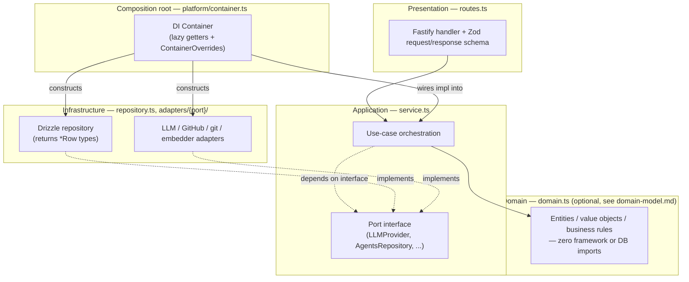
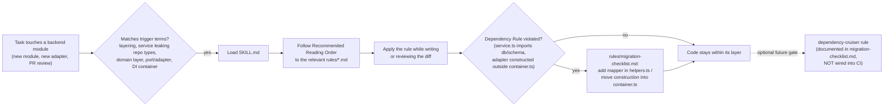

# onion-architecture

Forces Onion Architecture layering on DevDigest's backend (`server/src/modules/<name>/`, `server/src/adapters/<port>/`, `server/src/platform/container.ts`). Local, project-specific skill — not pulled from an external marketplace source (no `skills-lock.json` entry, unlike `drizzle-orm-patterns` or `fastify-best-practices`), because it encodes conventions specific to *this* codebase's module layout, not a generic library.

## Why this exists

The backend already implements ports-and-adapters for every external system (`@devdigest/shared` interfaces, `adapters/<port>/`, `platform/container.ts` as composition root — see `references.md`). What was missing was an explicit, checkable rule for the other half of Onion Architecture: keeping persistence types (Drizzle rows, `db/schema*.ts`) from leaking past `repository.ts` into `service.ts`/`routes.ts`, and a stated policy for when a module actually needs a dedicated domain layer versus staying a simple CRUD service. This skill makes both explicit, grounds every rule in real code from this repo (mostly `modules/agents/`), and proposes (but does not activate) a `dependency-cruiser` rule to make the layering rule a hard build check later.

## File map

| File | Purpose |
|---|---|
| [SKILL.md](SKILL.md) | Entry point — when to use, quick-reference layer table, reading order |
| [rules/layers.md](rules/layers.md) | The 4 layers, the Dependency Rule, forbidden imports per layer |
| [rules/module-layout.md](rules/module-layout.md) | Mapping onto `routes.ts`/`service.ts`/`repository.ts`/`helpers.ts`, the Row→DTO mapping boundary |
| [rules/ports-and-adapters.md](rules/ports-and-adapters.md) | `@devdigest/shared` port interfaces, `adapters/<port>/`, mocks |
| [rules/dependency-injection.md](rules/dependency-injection.md) | `platform/container.ts` as the single composition root |
| [rules/domain-model.md](rules/domain-model.md) | When `domain.ts` earns its keep vs. overengineering / anemic-model pitfalls |
| [rules/testing.md](rules/testing.md) | How layers map to unit tests vs. `*.it.test.ts` |
| [rules/migration-checklist.md](rules/migration-checklist.md) | Step-by-step refactor checklist + documented (not wired) `dependency-cruiser` gate |
| [examples.md](examples.md) | Good/bad code grounded in this repo (`modules/agents/` as the reference) |
| [references.md](references.md) | External sources + a note on what this skill adds on top of the existing codebase |

## The layering this skill enforces

Solid arrows are direct calls; dashed arrows are "implements/depends on the interface, not the concrete class." Everything points inward at Domain — Infrastructure and Presentation depend on the core, never the other way round. The Composition Root is the one place allowed to know about concrete classes on both sides, which is what makes `service.ts` swappable/testable without Docker (see `rules/testing.md`).

## How the skill itself gets used

The skill is advisory by default: an AI agent (or a human reviewer who reads it) applies the rules while writing/reviewing code. The `dependency-cruiser` step at the end is a proposal for later — turning the one hard rule (no persistence types past `service.ts`) into a build-breaking check — and is deliberately not activated, since wiring a new lint gate into CI is a team decision, not something this skill should do unilaterally.

## Scope

Applies going forward to new/changed modules; existing modules are migrated opportunistically via `rules/migration-checklist.md` when they're touched for other reasons — this skill does not ask for a repo-wide rewrite.
